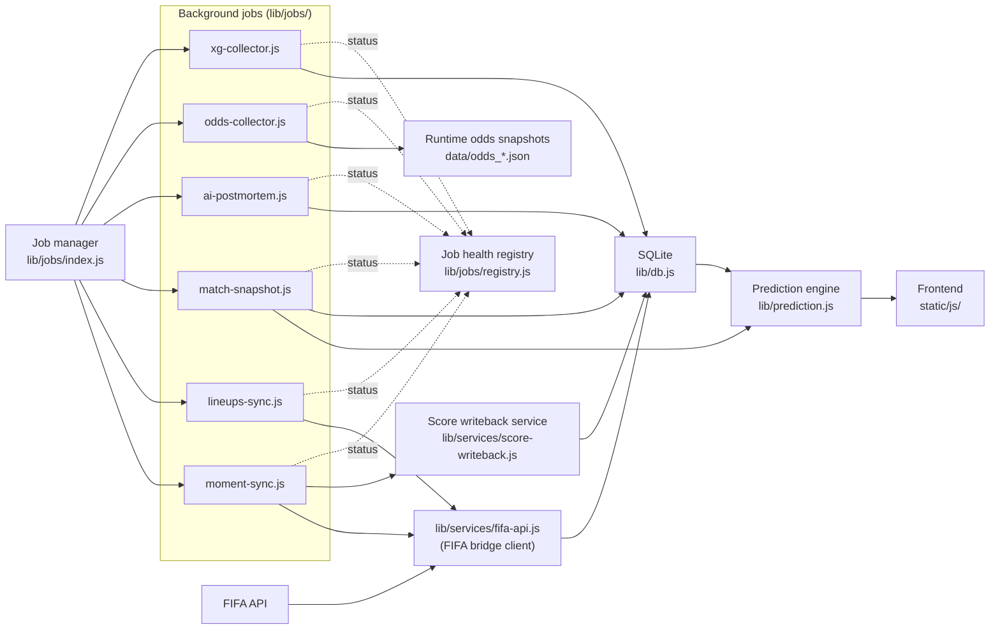

<!-- Note: update README.zh.md when this file changes -->
# ⚽ PitchSignal

**PitchSignal** is a World Cup intelligence system for fixtures, standings, team context, market comparison, live match interpretation, post-match review, and reproducible football forecasting.

The project is intentionally more than a prediction widget. Its research stance is that public probabilities should be auditable, versioned, and evaluated, while richer product signals such as odds, lineups, formations, news, pressure, coach context, venue context, and AI review should be visible without silently contaminating the probability model before they earn out-of-sample evidence.

👉 [Try the public beta now!](https://pitch-signal-production.up.railway.app) Some features are currently gated in Beta.

README in [中文](README.zh.md)

## 🌟 Core Capabilities
- **Fixtures, scores, and standings**: Live match lists, date-based schedules, match detail, group tables, computed standings, and qualification context.
- **Forecasting core**: Elo + Poisson/Dixon-Coles pre-match probabilities with model versioning, `configHash`, expected goals, likely scores, calibration reports, and backtesting tools.
- **Public market comparison**: Odds are shown openly as a market benchmark and divergence layer, so the model can be compared against external consensus rather than judged in isolation.
- **Live match interpretation**: In-play repricing from hard facts such as score, time, added time, red cards, and knockout state; soft pressure signals are displayed separately.
- **Tournament structure**: 2026 group logic, qualification scenarios, third-place resolution, and an interactive knockout bracket.
- **Team and player intelligence**: Team pages, player/roster enrichment, coach facts, recent form, lineup data, substitutions, suspensions, and player-name localization.
- **Formation and spatial matchup analysis**: Formation parsing, pitch layouts, positional pairings, and tactical mismatch visualization.
- **Match moments and post-match review**: Key events, swing moments, immutable pre-match snapshots, review evidence, and structured error attribution after the final whistle.
- **AI and knowledge layer**: AI Q&A and post-match analysis use the project knowledge base and evidence records as an explanation layer, not as an unverified probability override.
- **Production data pipeline**: Scheduled jobs for lineups, odds, match moments, prediction snapshots, score writeback, xG collection, and AI postmortem processing.

## 📊 Current Public Dashboard Metrics

The Railway public dashboard currently reports:

| Metric | Value |
|--------|-------|
| Brier | `0.5132` |
| Directional accuracy | `61.4%` |
| ECE | `16.3%` |

These are live dashboard metrics. For manuscript use, they should be tied to immutable per-match prediction artifacts: `modelVersion`, `configHash`, `predictedAt < kickoff`, data source, final result source, and a reproducible export.

## 🔬 Research Discipline

PitchSignal separates feature visibility from model authority:

- **Probability-forming signals** must be reproducible and evaluated.
- **Candidate signals** may be collected, displayed, and compared, but are kept behind evidence gates until they show stable out-of-sample value.
- **Market odds** are a public comparator and benchmark layer; direct odds fusion is a separate research claim that requires its own paired tests and calibration evidence.
- **AI review** can explain, summarize, and help generate research hypotheses, but does not silently rewrite public probabilities.
- **Negative results are retained** when a plausible signal fails to improve Brier, LogLoss, accuracy, or calibration.

## 🚀 Getting Started

### Prerequisites
- Node.js (v22 recommended)
- npm

### Installation
```bash
npm install
```
*(If you run into `better-sqlite3` native binding errors after syncing across devices, run `npm rebuild better-sqlite3`)*

### Running the Server
```bash
npm start
```
The application will be accessible at `http://127.0.0.1:5099`

### Testing
```bash
npm test
```
Runs the test suites for Prediction Models, Elo rating, and Poisson distribution logic.

## 📂 Project Structure
- `/lib` - Core business logic: `db.js`, `elo.js`, `poisson.js`, `prediction.js`
- `/lib/routes` - Modularized API handlers for entities, predictions, news, and core data.
- `/static` - Frontend JS, CSS, and SVG assets.
- `/templates` - Single Page Application HTML.
- `/data` - Static JSON files (brackets, base ratings, offline scrape data).
- `/data/sources/world-cup-history` - Local historical CSV inputs used for H2H enrichment.
- `/scripts` - Utilities for data scraping (e.g., Transfermarkt values).
- `/middleware`, `/services` - HTTP middleware and domain services.

## 🔄 Data Flow



## 🚢 Deployment

### Railway (Recommended)

1. Create a Railway project and connect the GitHub repository.
2. Add a **volume** at mount path `/usr/src/app/data` (SQLite + snapshots + runtime JSON).
3. Set environment variables (see below).
4. Railway auto-detects the `Dockerfile`.

### Docker (Self-hosted)

```bash
docker build -t pitch-signal .
docker run -p 5099:5099 -v $(pwd)/data:/usr/src/app/data pitch-signal
```

> ⚠️ SQLite does not support multiple instances. Set `numInstances: 1` (Railway) or `replicas: 1` (compose).

## 🔐 Environment Variables

| Variable | Required | Default | Notes |
|----------|----------|---------|-------|
| `PORT` | No | `5099` | Server port |
| `NODE_ENV` | No | `development` | `production` enables stricter security |
| `DATA_PATH` | No | `./data` | Mutable directory for SQLite, snapshots, and runtime WC2026 data. Must be mounted as a persistent volume when deployed. |
| `SEED_DATA_PATH` | No | `./resources/seed/wc2026` | Read-only WC2026 seed override path. Usually not needed. |
| `DB_PATH` | No | `${DATA_PATH}/predictions.db` | Override SQLite database path |
| `CORS_ORIGINS` | No | `localhost:5099` | Comma-separated allowed browser origins |
| `RATE_LIMIT_MAX` | No | `100` | Max requests per rate-limit window |
| `RATE_LIMIT_WINDOW_MS` | No | `60000` | Rate-limit window in milliseconds |
| `THE_ODDS_API_KEY` | No | — | the-odds-api.com key for market odds / divergence |
| `ODDS_API_KEY` | No | — | Legacy alias for `THE_ODDS_API_KEY` |
| `OWM_API_KEY` | No | — | OpenWeatherMap key (venue weather) |
| `BALLDONTLIE_API_KEY` | No | — | balldontlie.io roster/stats enrichment |
| `TAVILY_API_KEY` | No | — | Tavily search (AI post-match research) |
| `ANTHROPIC_API_KEY` | No | — | AI post-match review (experimental, beta disabled) |
| `VAPID_PUBLIC_KEY` | No | — | Web Push public key (goal notifications) |
| `VAPID_PRIVATE_KEY` | No | — | Web Push private key (goal notifications) |
| `VAPID_SUBJECT` | No | `mailto:ops@pitchsignal.app` | Contact URI required by the Web Push protocol |
| `ADMIN_TOKEN` | **Beta: must be unset** | — | Fallback token for protected endpoints |
| `BOT_API_TOKEN` | **Beta: must be unset** | — | Bot chat endpoint token |
| `WRITE_API_TOKEN` | **Beta: must be unset** | — | Write endpoint token |
| `POLYMARKET_ENABLED` | **Beta: must be `false`** | `false` | Market odds fusion |
| `PUNDIT_ENABLED` | **Beta: must be `false`** | `false` | Pundit opinion aggregation |
| `AUTO_CALIBRATION` | **Beta: must be `false`** | `false` | Auto parameter calibration |
| `AI_POSTMORTEM_ENABLED` | **Beta: must be `false`** | `false` | Background AI post-match review worker |
| `PRE_SNAPSHOT_MINUTES` | No | `30` | Minutes before kickoff to take prediction snapshot |
| `GROUP_POST_MINUTES` | No | `120` | Minutes after group match to post review |
| `KNOCKOUT_POST_MINUTES` | No | `180` | Minutes after knockout match to post review |
| `ANALYSIS_DELAY_MINUTES` | No | `10` | Delay before running post-match analysis |

> **Public Beta**: All three security tokens must be unset → anonymous write returns 401.
> All three feature gates are force-overridden to `false` at startup.
> See `docs/operations/public-beta-safety-manual.md` for details.

## 📖 API Reference

Full endpoint documentation: **[docs/knowledge/API.md](docs/knowledge/API.md)**

Quick overview:

| Module | Endpoints | Description |
|--------|-----------|-------------|
| Core | `/api/scores`, `/api/standings`, `/api/schedule`, `/api/match/:id` | Fixtures, scores, standings |
| Prediction | `/api/elo/*`, `/api/match-review/*`, `/api/post-match-review/*` | Elo rankings, predictions, reviews |
| Entities | `/api/player/:id`, `/api/team/:id`, `/api/coach/:teamId` | Player/team/coach profiles |
| Matchup | `/api/h2h/*`, `/api/matchup/*`, `/api/analysis/*` | Head-to-head, formations, spatial |
| News | `/api/match/:id/news`, `/api/news/search` | Match news, search |
| Bot | `POST /api/bot/chat` | AI Q&A (requires auth token) |
| Odds | `/api/odds/*`, `/api/odds-alerts` | Betting odds (mock when no API key) |
| Venue | `/api/venue/:id`, `/api/venue/:id/weather` | Stadium info, weather |
| Health | `GET /health` | Readiness check (503 on DB failure) |

## 📚 Documentation

- **[docs/repository-layout.md](docs/repository-layout.md)** - Where to put new files and which docs stay internal
- **[ARCHITECTURE.md](ARCHITECTURE.md)** - System architecture overview
- **[ENVIRONMENT.md](ENVIRONMENT.md)** - Environment variables and key hygiene
- **[CHANGELOG.md](CHANGELOG.md)** - Version history
- **[docs/knowledge/API.md](docs/knowledge/API.md)** - Full API reference
- **[docs/VERSIONING.md](docs/VERSIONING.md)** - Static asset / cache versioning strategy
- **[docs/knowledge/prediction_model_explanation.md](docs/knowledge/prediction_model_explanation.md)** - How the prediction model works
- **[docs/prediction-model-methodology.md](docs/prediction-model-methodology.md)** ([中文](docs/prediction-model-methodology.zh.md)) - Full methodology paper: architecture, evaluation protocol, 964-match backtest results, and honest limitations
- **[docs/research-publication-roadmap.md](docs/research-publication-roadmap.md)** - Academic publication route, venue requirements, and submission checklist for the methodology paper
- **[docs/research-pre-submission-review.md](docs/research-pre-submission-review.md)** - Mock pre-submission review of the methodology paper's journal readiness gaps
- **[docs/research-publication-execution-plan.md](docs/research-publication-execution-plan.md)** - Workstream plan for abstract, artifacts, calibration, paired tests, references, and manuscript worktrees
- **[docs/deployment-guide-railway.md](docs/deployment-guide-railway.md)** - Railway deployment guide
- **[docs/operations/public-beta-safety-manual.md](docs/operations/public-beta-safety-manual.md)** - Public beta safety & gates

## 📄 License

Code: [ISC](LICENSE). Third-party data attribution (FIFA, Open-Meteo, 26worldcup.github.io, and others): see [COPYRIGHT.md](COPYRIGHT.md).

## ⚠️ Disclaimer

- **Experimental probability model.** Predictions come from a custom Dixon-Coles-adjusted Poisson + Elo model. Outputs are statistical estimates for analysis and entertainment only — they are **not guarantees** of any result.
- **Not betting advice.** Nothing in PitchSignal is gambling or investment advice. Do not use it to place bets.
- **Third-party data dependency.** Live fixtures, scores, standings, and squads are fetched from the **ESPN API** (plus optional OpenWeatherMap / odds providers). PitchSignal does not own this data; availability, accuracy, and coverage depend entirely on those upstream sources and may break or lag without notice.
- **Single-instance deployment.** Persistence uses **SQLite** (single-writer). Run exactly **one** instance — do not horizontally scale — and keep the data directory on a persistent volume.
